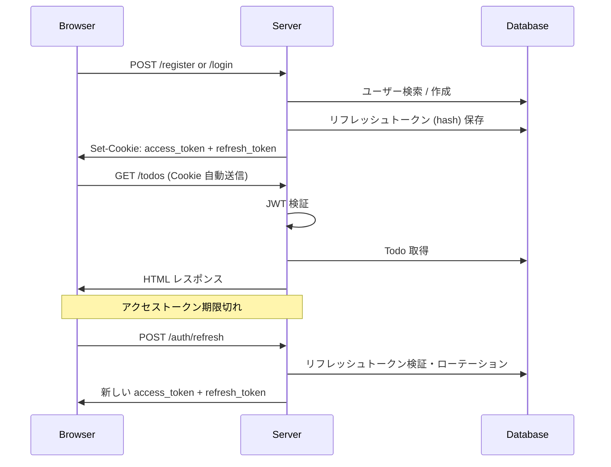

# 🚀 GOTHA Boilerplate

**GOTHA** = **Go** + **T**empl + **H**TMX + **A**lpine.js

モダンな Go Web アプリケーションの boilerplate です。
サーバーサイドレンダリングをベースに、HTMX による部分更新と Alpine.js による軽量インタラクションを組み合わせた、シンプルかつ実践的なスタックを提供します。

---

## ✨ Features

- 🔐 **JWT 認証** — アクセストークン + リフレッシュトークンによるセキュアな認証
- 📝 **Todo CRUD サンプル** — HTMX によるインライン編集・部分更新のデモ
- 🎨 **DaisyUI** — Tailwind CSS ベースの美しい UI コンポーネント
- 🗃️ **sqlc** — SQL ファイルから型安全な Go コードを自動生成
- 🔄 **Air** — ファイル変更時の自動リビルド（ホットリロード）
- ✅ **GitHub Actions CI** — Lint・テスト・ビルドの自動化

---

## 🛠️ Tech Stack

| Category | Technology |
|---|---|
| **Language** | [Go](https://go.dev/) 1.23+ (`net/http`) |
| **Templating** | [Templ](https://templ.guide/) |
| **Interactivity** | [HTMX](https://htmx.org/) + [Alpine.js](https://alpinejs.dev/) |
| **Styling** | [Tailwind CSS](https://tailwindcss.com/) + [DaisyUI](https://daisyui.com/) |
| **Database** | [PostgreSQL](https://www.postgresql.org/) 16 |
| **SQL Codegen** | [sqlc](https://sqlc.dev/) |
| **Migration** | [goose](https://github.com/pressly/goose) |
| **Auth** | JWT (`access_token` + `refresh_token` in HttpOnly cookies) |
| **Hot Reload** | [Air](https://github.com/air-verse/air) |
| **Node.js** | [mise](https://mise.jdx.dev/) で管理 |
| **CI** | [GitHub Actions](.github/workflows/ci.yml) |
| **Dev Env** | [Docker Compose](docker/docker-compose.yml) / [Tilt](https://tilt.dev/) |

---

## 📋 Prerequisites

以下のツールが必要です：

- [Go](https://go.dev/dl/) 1.23+
- [mise](https://mise.jdx.dev/) — Node.js のバージョン管理
- [Docker](https://docs.docker.com/get-docker/) & Docker Compose

> [!NOTE]
> [Tilt](https://docs.tilt.dev/install.html) はオプションです。`make dev` だけで開発を始められます。

---

## 🚀 Quick Start

```bash
# 1. リポジトリのクローン
git clone https://github.com/ttani03/gotha-boilerplate.git
cd gotha-boilerplate

# 2. 全ツール・依存関係のインストール
make setup

# 3. 環境変数の設定
cp .env.example .env
# 必要に応じて .env を編集（デフォルトのままローカル開発可能）

# 4. マイグレーションの実行
make migrate-up

# 5. 開発サーバーの起動
make dev
```

👉 **http://localhost:8080** にアクセス！

---

## 📜 Available Commands

| Command | Description |
|---|---|
| `make setup` | Go ツール + Node.js + npm パッケージのインストール |
| `make dev` | PostgreSQL 起動 + CSS ビルド + Air ホットリロード開発 |
| `make generate` | `templ generate` + `sqlc generate` |
| `make build` | Go バイナリのビルド |
| `make run` | ビルドして実行 |
| `make test` | テストの実行 |
| `make lint` | `golangci-lint` で静的解析 |
| `make css` | Tailwind CSS のビルド |
| `make css-watch` | Tailwind CSS のウォッチモード |
| `make docker-up` | Docker Compose で全サービス起動 |
| `make docker-down` | Docker Compose の停止 |
| `make migrate-up` | マイグレーション適用 |
| `make migrate-down` | 直前のマイグレーションをロールバック |
| `make migrate-create` | 新規マイグレーションファイル作成 |
| `make tilt-up` | Tilt で開発環境を起動 |

---

## 📁 Project Structure

```
gotha-boilerplate/
├── cmd/server/              # アプリケーションのエントリーポイント
│   └── main.go
│
├── internal/
│   ├── config/              # 環境変数の読み込み・設定
│   ├── db/
│   │   ├── migrations/      # goose マイグレーション (.sql)
│   │   ├── queries/         # sqlc クエリ (.sql)
│   │   └── generated/       # sqlc 自動生成コード
│   ├── handler/             # HTTP ハンドラー (auth, todo, home)
│   ├── middleware/          # ミドルウェア (logging, recovery, JWT auth)
│   └── server/              # ルーティング・サーバー設定
│
├── web/
│   ├── templates/
│   │   ├── layout/          # 共通 HTML レイアウト
│   │   ├── components/      # 再利用可能な UI コンポーネント
│   │   └── pages/           # ページテンプレート
│   ├── static/css/          # Tailwind CSS
│   └── tailwind.config.js
│
├── docker/
│   ├── Dockerfile           # 本番用マルチステージビルド
│   ├── Dockerfile.dev       # 開発用 (Air 入り)
│   └── docker-compose.yml   # PostgreSQL + アプリ
│
├── .github/workflows/
│   └── ci.yml               # GitHub Actions CI
│
├── Tiltfile                 # Tilt 設定
├── Makefile                 # ビルド・開発コマンド
├── sqlc.yaml                # sqlc 設定
├── .air.toml                # Air ホットリロード設定
├── .golangci.yml            # Linter 設定
├── .mise.toml               # mise (Node.js バージョン管理)
└── .env.example             # 環境変数テンプレート
```

---

## 🔐 Auth Flow

JWT トークンベースの認証を実装しています。



| Token | 保存場所 | 有効期限 | 用途 |
|---|---|---|---|
| Access Token | HttpOnly Cookie | 15 分 | API リクエスト認証 |
| Refresh Token | HttpOnly Cookie + DB (hash) | 7 日 | アクセストークンの再発行 |

---

## 🧪 CI (GitHub Actions)

`main` ブランチへの Push / Pull Request で自動実行されます：

1. **Lint** — `golangci-lint`
2. **生成コード検証** — `templ generate` / `sqlc generate` が最新か確認
3. **Test** — PostgreSQL サービスコンテナ + `go test`
4. **Build** — Go バイナリ + Docker イメージ

---

## 📄 License

[MIT](LICENSE)
